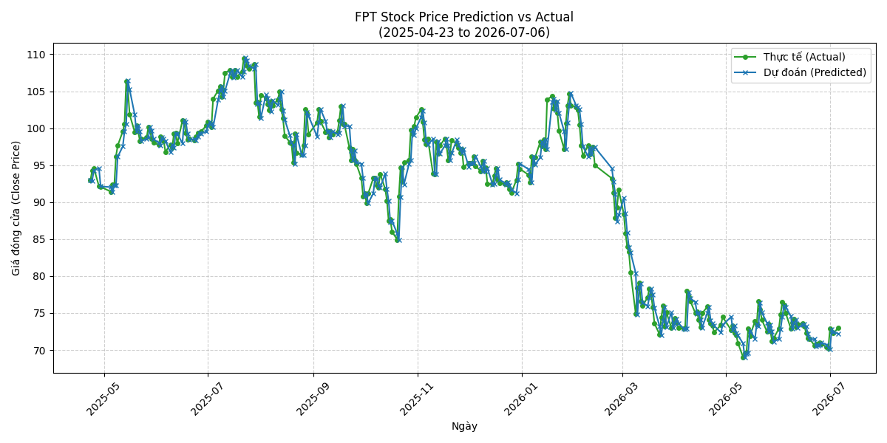

Dashboard Đánh Giá Mô Hình FPT

Thời gian đánh giá: 2026-07-06 21:43:25 (Giờ VN)

Model Checkpoint: `best_transformer_w3.pt`

Giai đoạn đánh giá: Từ `2025-04-23` đến `2026-07-06` (299 ngày)

## 📈 Tổng quan Metrics

| Metric | Giá trị |
|---|---|
| **MAE** | `1.3120` |
| **RMSE** | `1.7444` |
| **MAPE** | `1.4487` |
| **R2** | `0.9779` |
| **BIAS** | `-0.0119` |
| **DIRECTIONAL_ACCURACY** | `50.8361` |

Biểu đồ Thực tế vs Dự đoán

