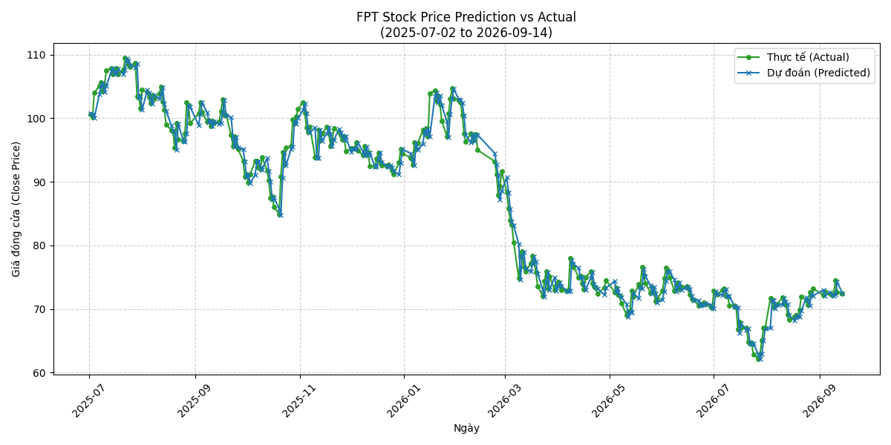

Dashboard Đánh Giá Mô Hình FPT

Thời gian đánh giá: 2026-08-17 18:51:41 (Giờ VN)

Model Checkpoint: `best_transformer_w3.pt`

Giai đoạn đánh giá: Từ `2025-06-09` đến `2026-08-17` (299 ngày)

## 📈 Tổng quan Metrics

| Metric | Giá trị |
|---|---|
| **MAE** | `1.2846` |
| **RMSE** | `1.7147` |
| **MAPE** | `1.4670` |
| **R2** | `0.9832` |
| **BIAS** | `-0.0509` |
| **DIRECTIONAL_ACCURACY** | `54.5151` |

Biểu đồ Thực tế vs Dự đoán

