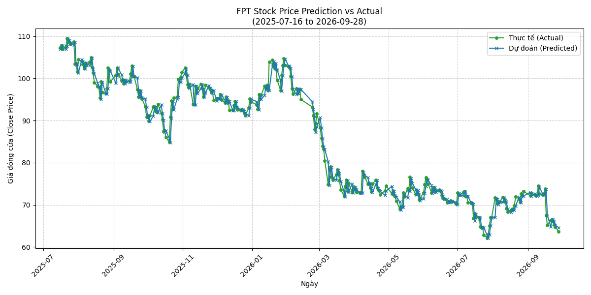

Dashboard Đánh Giá Mô Hình FPT

Thời gian đánh giá: 2026-09-29 01:41:52 (Giờ VN)

Model Checkpoint: `best_transformer_w3.pt`

Giai đoạn đánh giá: Từ `2025-07-16` đến `2026-09-28` (299 ngày)

## 📈 Tổng quan Metrics

| Metric | Giá trị |
|---|---|
| **MAE** | `1.2915` |
| **RMSE** | `1.7344` |
| **MAPE** | `1.5171` |
| **R2** | `0.9834` |
| **BIAS** | `-0.0032` |
| **DIRECTIONAL_ACCURACY** | `55.8528` |

Biểu đồ Thực tế vs Dự đoán

