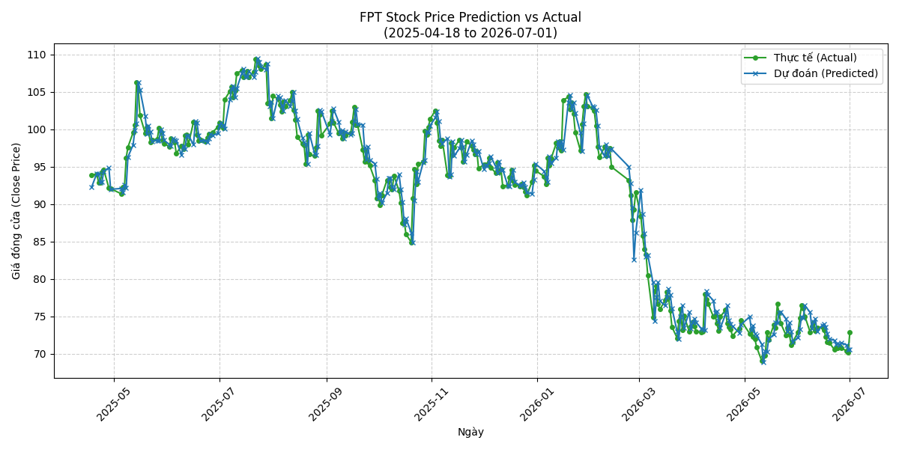

Dashboard Đánh Giá Mô Hình FPT

Thời gian đánh giá: 2026-07-02 01:30:39 (Giờ VN)

Model Checkpoint: `best_autoformer_w5.pt`

Giai đoạn đánh giá: Từ `2025-04-18` đến `2026-07-01` (299 ngày)

Tổng quan Metrics

| Metric | Giá trị |
|---|---|
| **MAE** | `1.3869` |
| **RMSE** | `1.8312` |
| **MAPE** | `1.5401` |
| **R2** | `0.9750` |
| **BIAS** | `0.1534` |
| **DIRECTIONAL_ACCURACY** | `46.1538` |

## 📉 Biểu đồ Thực tế vs Dự đoán

